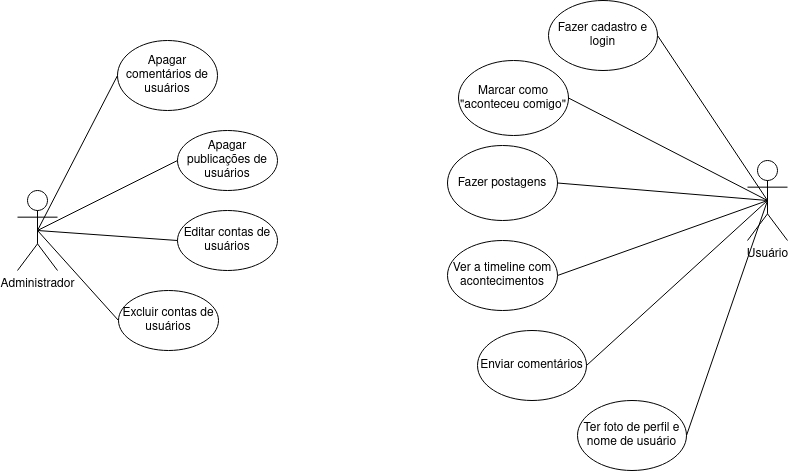
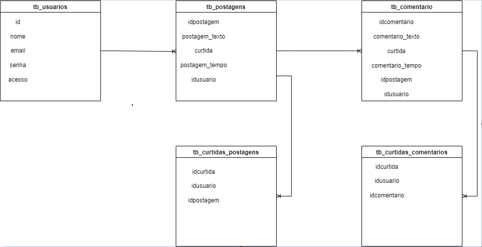

# Reclame ZN

Projeto Final do Curso Técnico Integrado de Desenvolvimento de Sistemas - Colégio Pedro II - Campus Duque de Caxias

**Integrantes:**
 - Guilherme Corrêa da Silva Paixão
 - Iverson Nascimento Correia
 - Matheus Siqueira Nunes de Souza

 ## Descrição do Projeto

O projeto consiste na reunião de reclamações sobre a Zona Norte do Rio de Janeiro. Os usuários farão postagens sobre acontecimentos inconvenientes que lhes ocorreram durante a vida cotidiana. Por exemplo, ao serem destratados por algum funcionário (seja público ou não), problemas da cidade em geral, como buracos ou falta de reformas, péssimas condições dos ambientes (público ou não), demora da fila de bancos, entre outros.
O objetivo do projeto é permitir que a população critique, revele e exponha os problemas da Zona Norte, com o intuito de promover mudanças e tornar a cidade do Rio de Janeiro melhor para o convívio social e para que haja uma melhor qualidade de vida dos cidadãos cariocas.
## Documentação

- [Manual do Usuário](manual.md)
- [Requisitos](requisitos.md)
- [Casos de Uso](casos-de-uso.md)
- [Apresentação](apresentacao.pdf)

**Diagrama de Classes**

**Modelagem do Banco de Dados**

