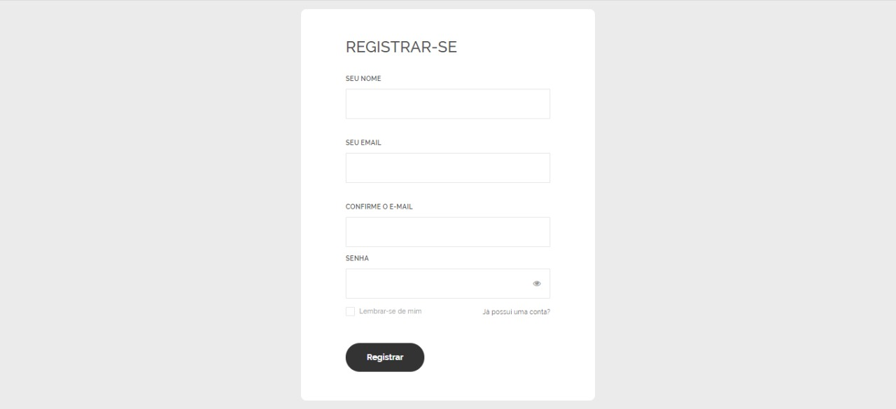
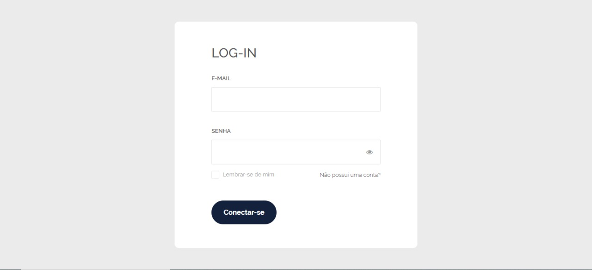
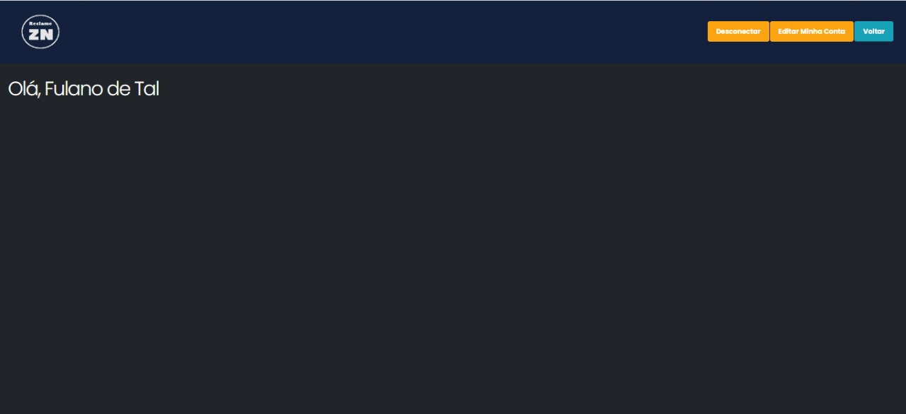
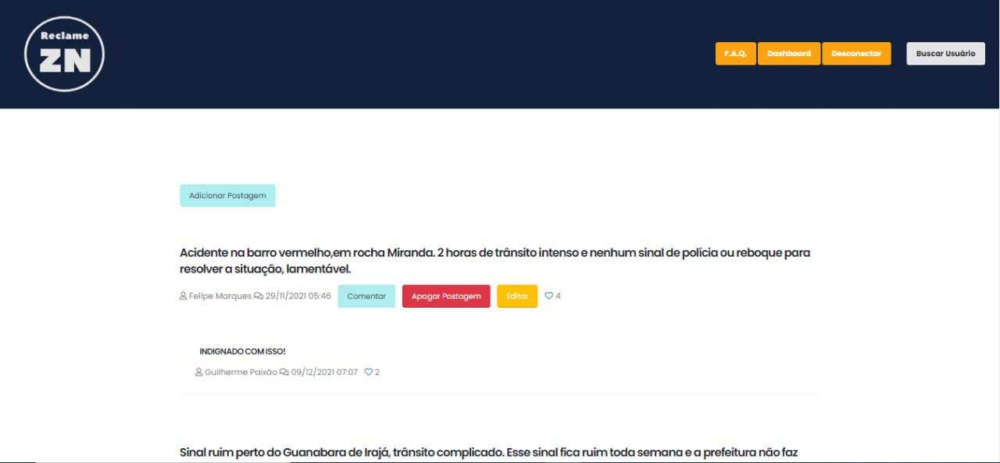
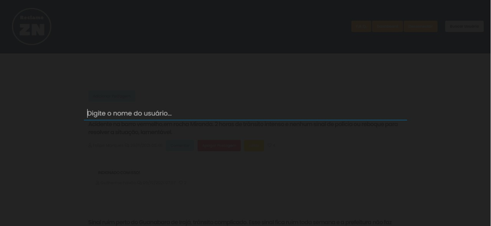
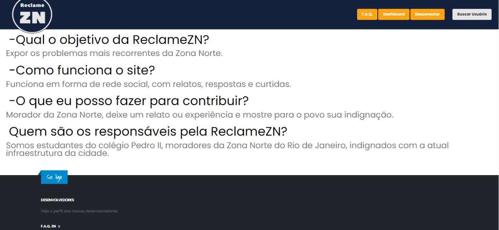

# Manual do Usuário

O projeto consiste na reunião de reclamações sobre a Zona Norte do Rio de Janeiro. Os usuários farão postagens sobre acontecimentos inconvenientes que lhes ocorreram durante a vida cotidiana. Por exemplo, ao serem destratados por algum funcionário (seja público ou não), problemas da cidade em geral, como buracos ou falta de reformas, péssimas condições dos ambientes (público ou não), demora da fila de bancos, entre outros. O objetivo do projeto é permitir que a população critique, revele e exponha os problemas da Zona Norte, com o intuito de promover mudanças e tornar a cidade do Rio de Janeiro melhor para o convívio social e para que haja uma melhor qualidade de vida dos cidadãos cariocas. Faremos agora um tour com você pelo site utilizando imagens internas!

**Lista das Funcionalidades:**

 - [Página de Cadastro](#página-de-cadastro)
 - [Página de Login](#página-de-login)
 - [Página de Dashboard](#página-de-dashboard)
 - [Página Inicial](#página-inicial)
 - [Busca de Usuários](#busca-de-usuários)
 - [F.A.Q](#F.A.Q)

## Página de Cadastro

Ao entrar no site, você será redirecionado para a tela de cadastro de usuários, onde deverá informar nome, email e senha para conseguir se registar com sucesso à rede Reclame ZN. Veja abaixo a tela de cadastro.

## Página de Login

Após ter efetuado o cadastro com sucesso, você será redirecionado para a página de login, onde deverá informar o email e senha novamente. Veja abaixo a tela de login. 

## Página de Dashboard

Se você conseguiu se cadastrar e inseriu os dados da conta corretamente, a tela abaixo deverá ser exibida.

## Página Inicial

Esta é a página inicial, onde aparece a opção de busca, realizar postagens, cometários e outros.

## Busca de Usuários

Esta é a busca de usuários. Aqui o internauta consegue buscar por pessoas digitando um nome completo ou até mesmo por uma única letra.

## F.A.Q

Se ainda restarem algumas dúvidas, visite a nossa página do F.A.Q e veja se a sua dúvida já se encontra presente.

